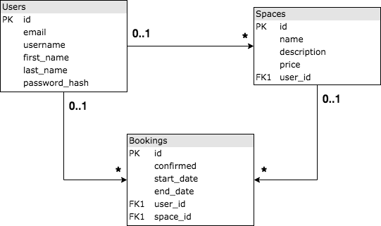

# MakersBnB


## Description

A clone of AirBnB using ruby with Sinatra and JavaScript. Features include user sign up / sign in / sign out, space listing and bookings. See more about the [design process](#design-process).


## Setup

Check that you have ruby installed

`ruby -v`

If not, install instructions can be found [here](https://www.ruby-lang.org/en/documentation/installation/).

Clone the repo on the command line by running

`git clone git@github.com:ewintram/instagram-challenge.git`

Check that you have bundler installed

`bundler -v`

If not, install by running

`gem install bundler`

Install dependencies by running

`bundle`

Check that PostgreSQL is installed

`psql -V`

If not, install instructios can be found [here](https://www.postgresql.org/download/).

To create the databases, on the command line run the following commands in sequence

```
psql postgres
create database "makersbnb_development";
create database "makersbnb_test";
\q
```


## Usage

To launch the app, run

`rackup`

Navigate to http://localhost:9292/spaces

### Views


Spaces page


Individual space page where user can make a booking


My bookings page displaying pending and confirmed bookings


My spaces page showing all of the spaces belonging to the current user

## Running tests

Testing is in RSpec and Capybara. To run the tests on the command line, run

`rspec`


## Authors

[Tom Brandon](https://github.com/Mnargh)

[Xin Wang](https://github.com/Xin00163)

[Tim Williamson](https://github.com/Le5tes)

Eleanor Wintram

## Design process

*Database structure*



### User Stories

```
As a User
So that I can let my space
I want to be able to list a space
```

```
As a User
So I can let all my homes
I want to be able to list more than one space
```

```
As a booking User
So I can choose a space
I want to view all the available spaces
```

```
As a letting User
So I can see which spaces I have listed
I want to view all my spaces
```

```
As a User
So people know about my space
I want to be able to give it a name and description
```

```
As a User
So I can make money
I'd like to add a price per night to my space
```

```
As a User
So people can book my space when it's available
I want to be able to list available dates
```

```
As a User
To make sure other users know who I am
I want to be able to sign up
```

```
As a signed up User
So I can stay at a space
I'd like to be able to request a space for a night
```

```
As a User letting a space
So that I choose who books my space
I want to be able to approve requests
```

```
As a letting User
So that I don't end up with too many people in my space
I want my space to be no longer available when I approve a booking request
```

```
As a booking User
So that I don't end up sleeping on the same bed as someone else without their consent
I only want to book available spaces

```
### Mockups


## 
## 
## 
